# 🛡️ Phylaxify: The Quiet Guardian of Digital Spaces

A high-performance AI-powered filtering system designed to protect content creators and streamers from donation spam, illegal gambling promotions, predatory loans, and malicious bots. Built with a **Triple-Layer Shield** architecture and a real-time **OBS Overlay Integration**.

## 🎥 Demo

Click the image below to watch the demo video:

<p align="center">
  <a href="https://drive.google.com/file/d/190MZR-jwwPE4057kRnFTITIT2SHzoXuk/view">
    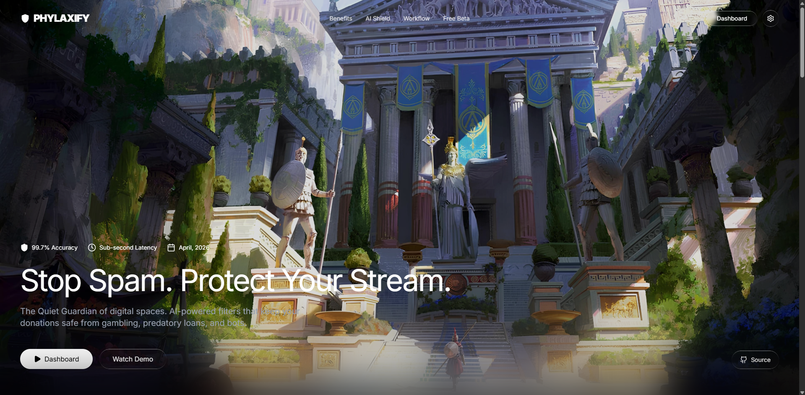
  </a>
</p>

## 📸 Preview

<p align="center">
  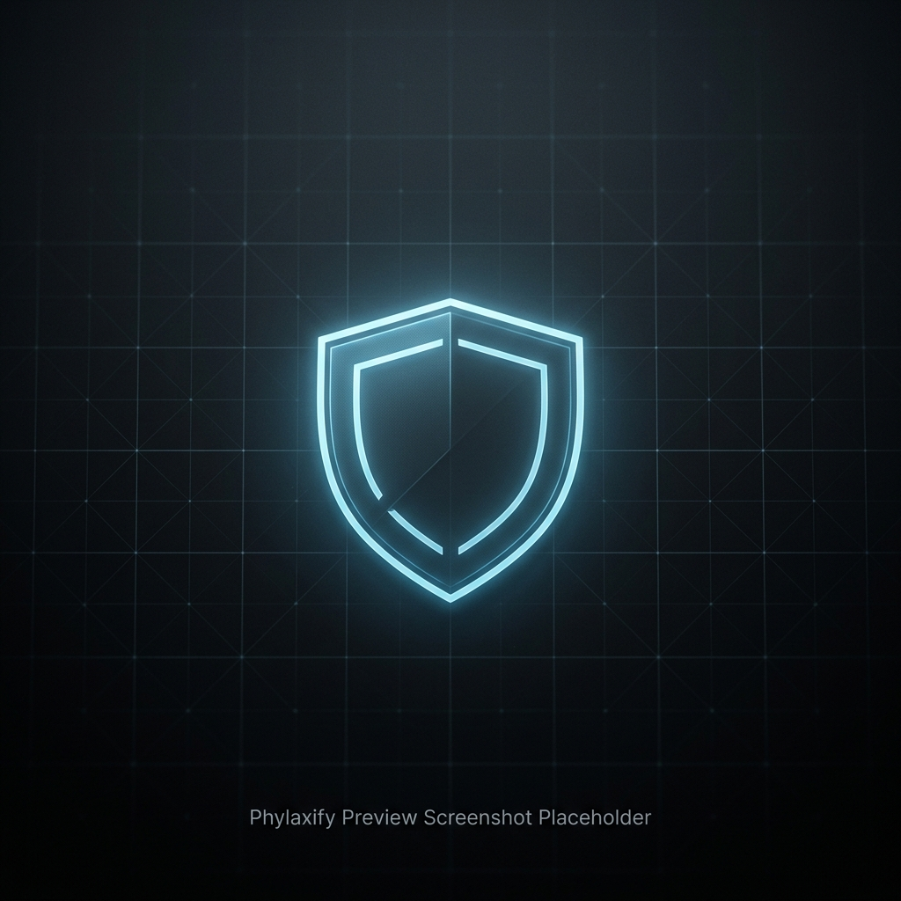
  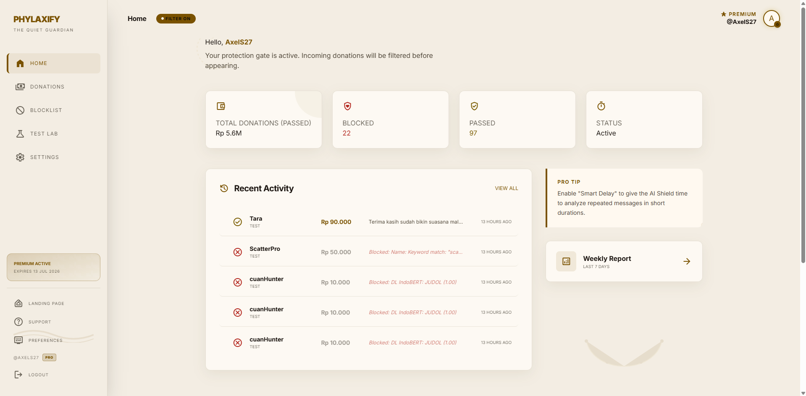
  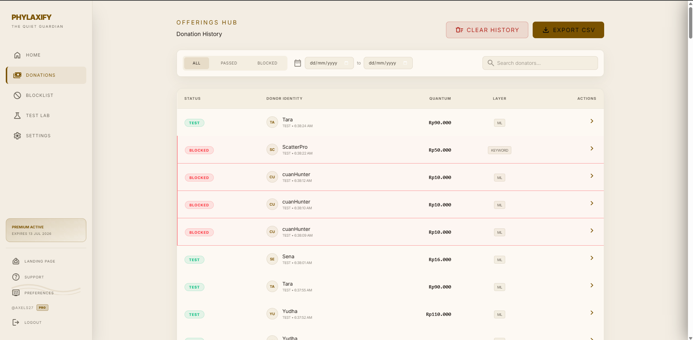
  <br/>
  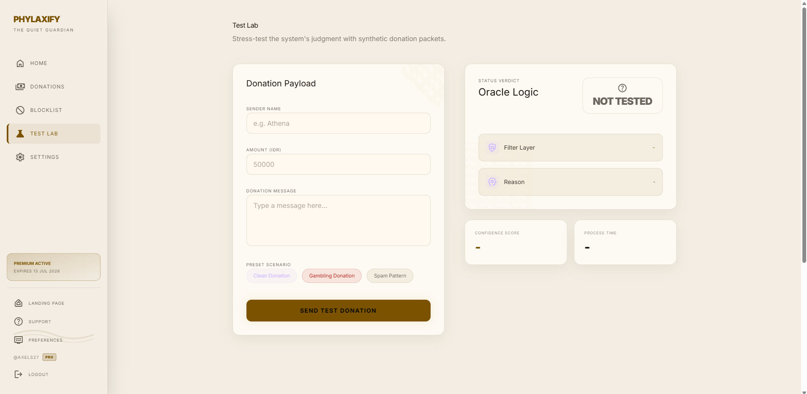
  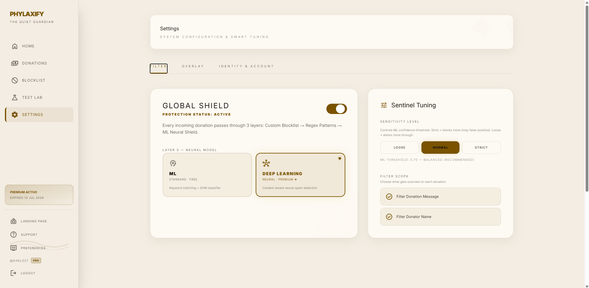
  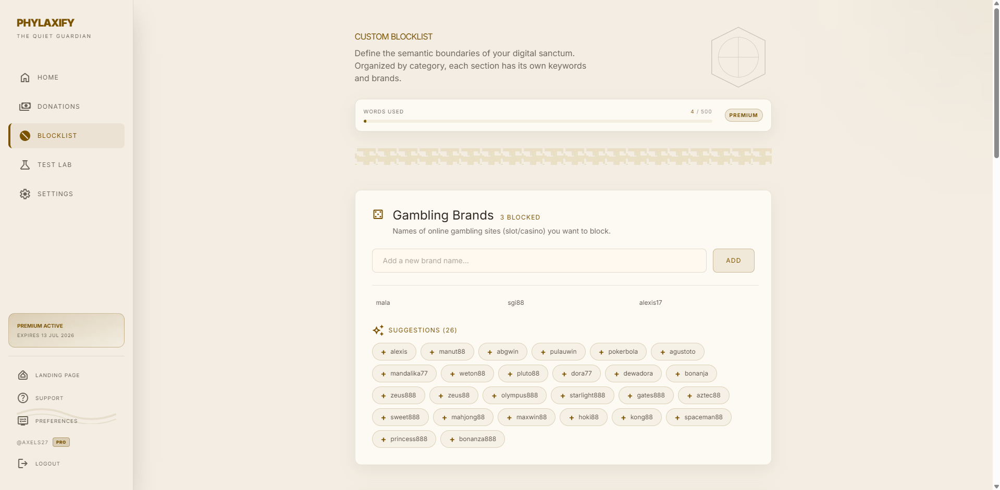
  <br/>
  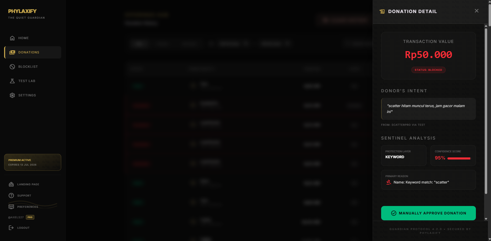
  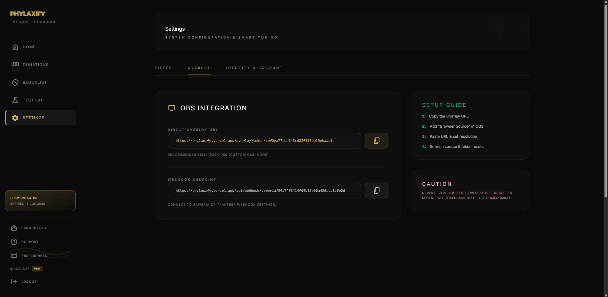
</p>

---

## 🏛️ System Architecture

> Phylaxify moves away from traditional monolithic models in favor of a **Distributed** approach (leveraging specialized cloud services) to ensure high scalability and performance.

<br/>
<br/>

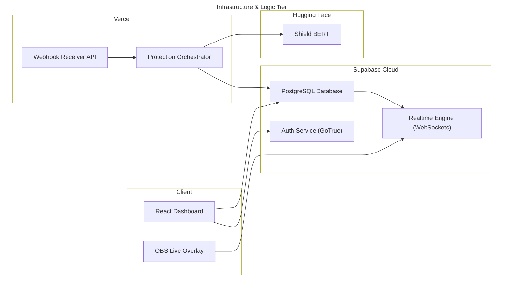

Phylaxify's distributed model ensures that each component can scale independently:

- **Cloud Infrastructure**: **Supabase** handles Auth and DB management, providing a secure, auto-scaling data layer.
- **Microservice Isolation**: The AI Inference Engine (**Shield BERT**) is isolated as a dedicated microservice, allowing it to scale independently on GPU-optimized hardware.
- **Event-Driven Webhooks**: High-performance Vercel functions orchestrate the "Shield Logic" only when a donation event is triggered.

## 🏛️ System Communication Flow

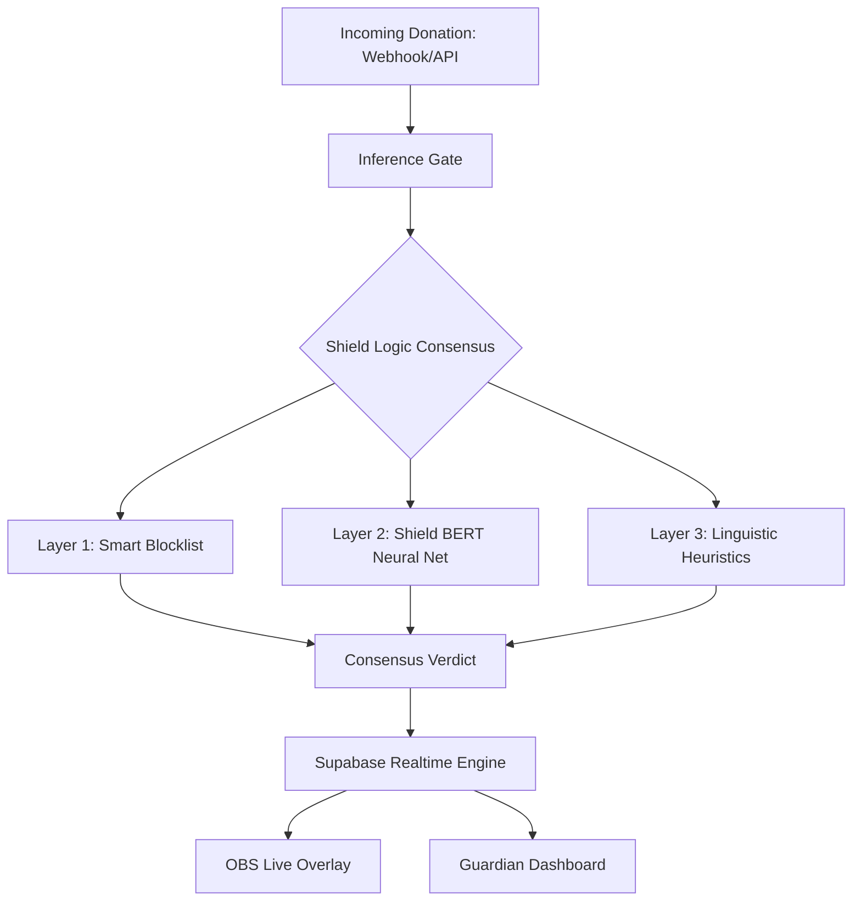

## 🏁 Quick Start

### **1. Guardian Dashboard (Web UI)**

```bash
# Clone the repository
git clone https://github.com/AxelS27/Phylaxify.git
cd Phylaxify

# Install dependencies
npm install

# Launch development server
npm run dev
```

### **2. Environment Configuration**

Create a `.env` file in the root directory with your Supabase credentials:

```env
VITE_SUPABASE_URL=your_supabase_url
VITE_SUPABASE_ANON_KEY=your_anon_key
```

## 🚀 Key Features

* **Triple-Layer Defense**: Combines deterministic Regex/Keyword matching with probabilistic Neural Analysis (BERT) and linguistic heuristics.
* **Sub-second Latency**: Engineered for live environments, ensuring protection decisions are made in under 200ms to maintain stream flow.
* **OBS Real-time Overlay**: Dynamic overlay system that broadcasts "Passed" or "Blocked" status instantly to your production software.
* **Smart Analytics Hub**: Comprehensive dashboard to monitor protection logs, confidence scores, and spam trends.
* **Proactive Blocklist**: Pre-configured filters specifically tuned for regional "Judol" (gambling) and predatory loan patterns.

## 🏗️ Full-Stack Architecture & Infrastructure

## 🛠️ Technology Stack Detail

### **1. Frontend: The Guardian Interface**

- **Framework**: **React 19** with **TypeScript** and **Vite**.
- **Styling**: **Vanilla CSS** : a custom framework focused on cinematic aesthetics, glassmorphism, and responsive layouts.
- **Motion Engine**: **Framer Motion** for micro-animations and fluid section transitions.

### **2. Backend: Data & Realtime Layer**

- **Infrastructure**: **Supabase** handles all persistent data, including protection logs, user profiles, and custom blocklists.
- **Auth Service**: Managed **GoTrue** via Supabase for secure, encrypted user authentication.

### **3. AI Engine: Shield BERT**

- **Model Architecture**: Based on the **BERT (Bidirectional Encoder Representations from Transformers)** model.
- **Fine-tuning**: Specifically trained on a custom dataset of regional spam patterns, "leetspeak" gambling promotions, and predatory loan messages.
- **Inference**: Optimized for sub-second responses using **ONNX Runtime** or specialized serverless workers.

### **4. Deployment & DevOps**

- **Dashboard Hosting**: **Vercel** (Global Edge Network) for maximum frontend performance.
- **API Layer**: **Vercel Serverless Functions** (Node.js/Python) for handling webhooks and shield logic.
- **Inference Hosting**: **Hugging Face Spaces** (Dockerized) for heavy-duty AI processing or **Vercel Edge Functions** for lightweight heuristics.
- **Database**: **Supabase Cloud** (AWS Infrastructure).

## 🛠️ Technology Stack

### **Core Intelligence & Security**

- **Shield BERT**: Context-aware neural network for detecting "hidden" spam patterns.
- **Smart Filter Engine**: High-performance Regex and Keyword processing.
- **Consensus Logic**: Weighted voting mechanism between AI and rule-based layers.

### **Guardian Interface**

- **Frontend**: React 19, TypeScript, Vite.
- **Styling & Motion**: Custom CSS + Framer Motion for rich, cinematic aesthetics.
- **Database & Realtime**: Supabase.

## 🧠 The 'Triple-Layer' Protection Engine

Our protection framework is designed to eliminate both obvious spam and sophisticated, context-dependent malicious messages.

### **1. Analytical Pipeline**

To ensure absolute security, every incoming message passes through a 3-stage validation gate:

- **Smart Blocklist (Layer 1)**: Immediate rejection of known blacklisted terms, domains, and regex patterns.
- **Shield BERT (Layer 2)**: Analyzes the semantic intent of the message. This catches spam that uses "leetspeak" or creative spacing to bypass traditional filters.
- **Linguistic Heuristics (Layer 3)**: Examines character distributions, URL density, and suspicious patterns common in automated bot attacks.

### **2. Shield Verdict Comparison**

| Layer                  | Type          | Detects                    | Latency |
| :--------------------- | :------------ | :------------------------- | :------ |
| **Smart Filter** | Deterministic | Known Keywords / Domains   | < 10ms  |
| **Shield BERT**  | Neural        | Contextual & Hidden Spam   | ~150ms  |
| **Heuristics**   | Statistical   | Bot Patterns & Repetitions | < 30ms  |

### **3. Performance Integrity**

Phylaxify is optimized for high-traffic environments, maintaining a **99.7% Accuracy Rate** in identifying malicious donation payloads while ensuring legitimate viewer interaction remains uninterrupted.

## 📂 Repository Roadmap

- **[src/pages/](./src/pages/)**: Core functional views (Dashboard, Test Lab, Settings).
- **[src/components/](./src/components/)**: Reusable UI components built with "Rich Aesthetics" principles.
- **[src/lib/](./src/lib/)**: Integration logic for Supabase, Auth, and Profile management.
- **[src/overlay/](./src/overlay/)**: (Planned) Dedicated logic for OBS browser source integration.

---

© 2026 AxelS27 | **Guardian of Digital Integrity**
